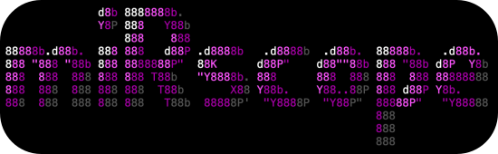

<p align="center">
  
</p>

<p align="center">
  <b>Comparative analysis and evolutionary conservation of microRNAs (miRNAs).</b>
</p>

<p align="center">
  
  
  
  
  
</p>

## Introduction

MIRSCOPE compares miRNAs across species centered on the **seed region**
(nucleotides 2–8), the functionally most important part for target recognition.
It groups miRNAs by their seed and reports which species share them, revealing
how conserved (evolutionarily widespread) each miRNA family is.

It offers two analysis modes:

- **macro** — broad conservation. Groups miRNAs purely by exact seed identity,
  without alignment. Fast; ideal for a quick view of large family spread.
- **strict** — orthology by cohesion. Aligns each seed family with **MAFFT** and
  applies a base-to-base identity cutoff (default **85%**) to isolate true
  mature orthologs, while still rescuing species-specific miRNAs.

The full miRBase reference database ships inside the package
(`mirscope/data/`, ~259 species), so analyses work out of the box. Results
include publication-ready UpSet plots, detailed Excel tables, and an interactive
Streamlit explorer (`mirscope-explore`).

## Installation

Requires **Python 3.8+**. MAFFT is a native binary (needed only for the strict
mode) that `pip` cannot install; the options below handle it.

### Manual (for now)

```bash
git clone https://github.com/gabrielvpina/miRScope.git
cd miRScope
pip install .
```

`pip install` pulls all Python dependencies (pandas, matplotlib, biopython,
streamlit, plotly, …) and registers the commands `mirscope`, `mirscope-setup`
and `mirscope-explore`.

Then provide **MAFFT** in one of these ways:

- **Recommended:** run the bundled setup, which installs [pixi](https://pixi.sh)
  and MAFFT into an environment inside the package. `mirscope` finds it
  automatically afterwards:
  ```bash
  mirscope-setup
  ```
  To remove that managed environment later: `mirscope-setup --clean`.

- **System package** (if you prefer): `brew install mafft` (macOS) or
  `sudo apt install mafft` (Debian/Ubuntu).

Alternatively, if you already use pixi, a single command sets up everything
(Python deps + MAFFT):

```bash
pixi install
pixi run mirscope strict --out results
```

### Docker

A `Dockerfile` is included. MAFFT is installed from the OS repositories, so the
image is fully self-contained (no `mirscope-setup` needed).

```bash
docker build -t mirscope .
```

Run the pipeline (mount a folder to keep the outputs):

```bash
docker run --rm -v "$PWD/results:/app/results" mirscope strict --out results
```

Run the interactive explorer (override the entrypoint and expose the port):

```bash
docker run --rm -p 8501:8501 --entrypoint mirscope-explore \
  mirscope --server.address=0.0.0.0
```

Then open http://localhost:8501.

## Usage

```
mirscope {macro,strict} [cutoff] [--data DIR] [--input FASTA ...] [--out DIR]
                        [--top-n N] [--min-size N] [--min-degree N] [-v]
```

| Argument | Description | Default |
|---|---|---|
| `mode` | `macro` (broad conservation) or `strict` (orthology by cohesion) | — |
| `cutoff` | Identity cutoff percent (strict mode only) | `85` |
| `--data DIR` | Reference FASTA folder. Resolves to the **bundled** miRBase database if omitted | bundled `mirscope/data/` |
| `--input FASTA ...` | One or more input FASTA files added to the analysis, compared against the reference | — |
| `--out DIR` | Output directory (created if missing) | current directory |
| `--top-n N` | Show only the N largest intersections in the UpSet plot (`0` = all) | `10` |
| `--min-size N` | Show only intersections with at least N miRNAs | `1` |
| `--min-degree N` | Show only intersections spanning at least N species (`2` = shared-only) | `1` |
| `-v`, `--verbose` | Enable DEBUG-level logging | off |

The filter flags (`--top-n`, `--min-size`, `--min-degree`) affect the **UpSet
plot only** — the exported tables always keep every row. They can also be
adjusted live in `mirscope-explore`.

### Input data

- The reference database (`--data`) is one FASTA file per species. The bundled
  default already contains the full miRBase.
- Your own `--input` files must be named `mirna_Genus_species.fasta`
  (e.g. `mirna_Homo_sapiens.fasta`) so the species is recognized; otherwise the
  file name is used as the species label.
- The UpSet plot requires at least 2 species; the Excel tables are produced
  regardless.

### Examples

```bash
# Broad conservation across the whole bundled reference
mirscope macro --out results

# Strict orthology, adding your own species, showing only shared intersections
mirscope strict --input mirna_My_species.fasta --out results --min-degree 2

# Strict with a stricter cutoff (95%) and the top 40 intersections
mirscope strict 95 --out results --top-n 40
```

## Outputs

All files are written to `--out` (default: current directory).

### macro

| File | Content |
|---|---|
| `output_mode1_macro_detailed.xlsx` | One row per miRNA: seed, number of species per seed, species, id, sequence |
| `output_mode1_matrix_upset.xlsx` | Boolean presence/absence matrix (seeds × species) — load it in `mirscope-explore` |
| `results_mode1_macro.png` | UpSet plot of seed-family conservation across species |

### strict

| File | Content |
|---|---|
| `output_mode2_alignments.fasta` | All MAFFT alignments, grouped by seed |
| `output_mode2_clusters_detailed.xlsx` | Which cohesion cluster each miRNA belongs to |
| `output_mode2_matrix_upset.xlsx` | Boolean presence/absence matrix (clusters × species) |
| `output_mode2_intersection_groups.xlsx` | Readable table of species intersections and their member clusters |
| `output_mode2_strict_upset.png` | UpSet plot of orthologous clusters across species |

## Interactive app (mirscope-explore)

`mirscope-explore` opens a Streamlit dashboard to explore the results
interactively, without re-running the pipeline:

```bash
mirscope-explore
```

- Upload the strict-mode matrix (`output_mode2_matrix_upset.xlsx`, or a
  CSV/Parquet presence/absence matrix) in the sidebar.
- Adjust the filters in real time — **species**, **min-degree**, **top-n**,
  **min-size** — and the **Plotly UpSet plot** updates instantly.
- **Hover a bar** to see the `miRNA_ID`s shared in that intersection.
- Toggle **light/dark** appearance (light by default).
- Download the current intersections as CSV.

Because heavy computation (MAFFT alignment) runs once in the pipeline, exploring
the filters here is instantaneous. See the Docker section above for running the
explorer in a container.

## Authorship and citation

Developed by Tatyana Chagas Moura / BiovirLab.
